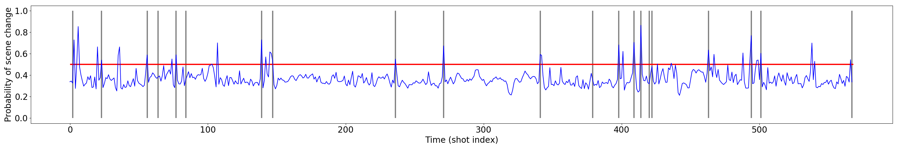
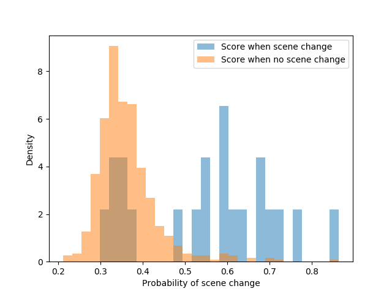

# Scene detection with visio-temporal CNN

This repo contains python scripts to train and evaluate a visio-temporal CNN to detect scene change.

## Installation

First clone this git. Then install conda. Go to the root of the project and install the dependencies with the following command :

```
conda env create -f ./environment.yml
```

### Data bases :

Here is how to get and format the different dataset I used to train (Youtube-large, Hollywood2) and to evaluate the models (BBC PlanetEarth, OVSD, RAI dataset, Ally McBeal dataset).

Before any thing : create a folder "data" at the root of the project and set the working directory to "code".

This datasets are sometimes big, so expect a long download time (it took me two or three days to download the 25k videos from youtube).

#### HollyWood2 :

Run the script :

```
./formatHolly2.sh
```

This script downloads the videos and format them so they can directly be used for training or evaluation after. To know more, I have
put comments in the script.

#### Youtube Large

Run the script :

```
./formatYoutube.sh
```

Same thing here : it downloads the videos and format them so they can directly be used. There is also comments in the script.


### OVSD

For this dataset, things are not fully automatic because there are several links to download each video on the IBM website, but many of them are dead. So, for each video,
you may have to try several links.

The links to download each video from the OVSD dataset can be found on the IBM website : http://www.research.ibm.com/haifa/projects/imt/video/Video_DataSetTable.shtml

Once the video are downloaded, put them in a folder called 'OVSD' in the 'data' folder. Also download the annotations (the button 'Full dataset meta-data download' at the bottom of the page) and put the folder containing them in the 'OVSD' folder as well. Ensure that the video name are the same than the annotations file. For example if a video is named 'filmA.avi' then its annotation should be named 'filmeA_scenes.txt'. Before using the dataset you must run the following command to run the shot segmentation by ffmpeg :

```
python formatData.py --dataset youtube_large --format_ovsd
```

You can change the default threshold value for shot detection with the "--shot_thres" argument :

```
python formatData.py --dataset OVSD --format_ovsd --shot_thres 0.6
```

### BBC

To download the videos of, go to the following link : "https://www.mediafire.com/folder/texdwptt9242j/BBCPH". Once the video are downloaded, put them in a folder called "PlanetEarth" in the "data" folder. To dowload the shots and scene segmentation ask them to the authors with this form "http://www.aimagelab.unimore.it/imagelab/page.asp?IdPage=5". Put the folder 'annotations' sent by the authors in the same folder than the videos.

Run the following command :

```
python formatData.py --format_bbc <EXT>
```

Where <EXT> is the extension of the videos you have downloaded. If the extension of your videos is "mp4", replace "<EXT>" in the above command by "mp4".
You cannot use the "--shot_thres" argument because the shots are pre-segmented.

### RAI Dataset

Use the script :

```
./formatRAI.sh
```

You can modify the last command of this script to change the shot detection threshold like this :

```
python formatData.py --format_rai --shot_thres 0.6
```

### AllyMcBeal

First, get the 4 first episodes of AllyMcBeal's first season. Obviously, I am not providing you any link for that. Download the annotations with this link : "http://herve.niderb.fr/data/ally_mcbeal.html". Put the downloaded folder and the videos in a folder called "AllyMcBeal" in the "data" folder. Then run :

```
python formatData.py --format_allymcbeal <EXT>
```

Where <EXT> is the extension of the videos you have downloaded. If the extension of your videos is "mp4", replace "<EXT>" in the above command by "mp4".
You cannot use the "--shot_thres" argument because the shots are pre-segmented.

## Usage

### Keep training a model

It might happen that the program is interupted during the training of a model. No worries. The weights of a model are saved at every epoch so you just have to check the path of the last saved weight file and type :

```
python trainVal.py -c model.config --exp_id expName --model_id modelName --init_path <path_to_last_saved_weight_file> --start_mode fine_tune
```

The "--start_mode fine_tune" argument will make the script to check the value of "--init_path" and set the weights to the values found at the path indicated.

You also save to set the arguments you set during first training. For example, the temporal component is a "resnet50" you have to re-indicate it at re-starting :

```
python trainVal.py -c model.config --exp_id expName --model_id modelName --start_mode fine_tune --init_path ../models/expName/modelresnet50_epoch58 --temp_model resnet50
```

### Model components

To train a model with a resnet101 to extract visual features and a resnet50 to model dependencies :

```
python trainVal.py -c model.config --exp_id testRes101 --temp_model resnet50 --feat resnet101
```

But if you prefer an LSTM instead of the resnet101 :

```
python trainVal.py -c model.config --exp_id testRes101 --temp_model RNN --feat resnet101
```

To extract visual features you can use : "resnet18", "resnet50", "resnet101" and for the temporal component you can use : "resnet18", "resnet50", "resnet101" and "RNN".

## Compute the scores given by a model on a specific dataset :

To evaluate a model on a specific dataset, for example a dataset which folder name is "OVSD", run :

```
python trainVal.py -c model.config --exp_id evalOVSD --model_id res50_res101 --train_part_beg 0 --train_part_end 0 \
                                                                             --val_part_beg 0 --val_part_end 1 \
                                                                             --dataset_val OVSD \
                                                                             --epochs 157
                                                                             --start_mode fine_tune --init_path ../models/trainExp/modelres50_res50_epoch157
```

This will evaluate the model called "res50_res101" initialized with the weight found in "./models/trainExp/modelres50_res101_epoch157", on the dataset OVSD.
It is important you set "--train_part_beg 0 --train_part_end 0" otherwise, it will start training the model. It is also important that you set "--epochs 157" because
the weights of the model were obtained at epoch 157

This command will start evaluating the model. It will store metrics value in a tf file you can visualise with :

```
tensorboard --logdir=../results/evalOVSD
```

It will also save the scores produced by the model in one csv file per video in the evaluated dataset : "../results/evalOVSD/res50_res101_epoch157_<videoName>.csv". Those csv files contains two columns : the first indicates the index of the key frame that represents the shot and the second the scene score change given by the model to this shot. These files look like this :

"
0.000000000000000000e+00 3.093410432338714600e-01 \
5.640000000000000000e+02 4.013364613056182861e-01 \
6.300000000000000000e+02 3.250870108604431152e-01 \
8.410000000000000000e+02 5.841270089149475098e-01 \
8.420000000000000000e+02 2.834158241748809814e-01 \
8.740000000000000000e+02 5.028665065765380859e-01 \
9.420000000000000000e+02 8.171656131744384766e-01 \
9.720000000000000000e+02 6.951807737350463867e-01 \
1.008000000000000000e+03 4.523631632328033447e-01 \
1.070000000000000000e+03 3.618693947792053223e-01 \
...
"

In the processResults.py script there are functions to read those csv files and produces figures to visualise the predictions and also tables that summarise model performance under various metrics. I will now explain how to do that.

### Visualise the scores given by a model on a specific dataset :

This requires to have computed the scores before, with the method described just above.

You can use the processResults.py script to visualise the predictions of a model. Let's say you want to visualise the predictions of the model we just talked about :

```
python processResults.py -c model.config --plot_score --dataset_test OVSD --exp_id evalOVSD --model_id res50_res101 --epoch 157
```

This produces several kind of figures :

- The score evolution during each video along with the ground truth scene change. For example, the file "vis/evalOVSD/Scores_res50_res101_epoch157_1000_days.png" plot the scores of the video "1000_days" :

<figure>
  
 <figcaption>Scene change score given by the model res50_res101 to the video 1000_days. The vertical gray lines indicates the start of new scenes (i.e. it's the ground truth) and the horizontal red line is the decision threshold at 0.5 : if the scene change score gets above 0.5, the model predicts a scene change.</figcaption>
</figure>

- Histograms that show distribution of scores values conditionned on whether there is a scene change or not. For example "vis/evalOVSD/Hist_res50_res101_youtLarg_7_epoch157_1000_days_sco.png" show score distribution when there is a scene change and when there is not :

<figure>
  
 <figcaption>Distribution of scene change score</figcaption>
</figure>

### Evaluate the scores given by a model on a specific dataset :

This requires to have computed the scores before, with the method described just above.

To get a table that show the metric value for a model evaluated on a dataset, run :

```
python processResults.py --exp_id OVSD --dataset_test OVSD --len_pond --model_id res50_101 --eval_model_leave_one_out 157 0 1 --model_name "Res50-Res101"
```

This will produce the file "result/OVSD_metrics.csv" which contains the metrics for the model. This table contains two line per model. The first line show the performances when the decision threshold of the model is tuned with the leave-one-out procedure (it is tuned on every video but one, evaluated on this one, and this is repeated by changing the evaluated video until all video have been evaluated.). In the second line, the model is evaluated using the default threshold (i.e. 0.5).


If you run this command with another model, let's say :

```
python processResults.py --exp_id OVSD --dataset_test OVSD --len_pond --model_id res50_50 --eval_model_leave_one_out 144 0 1 --model_name "Res50-Res50"
```

It will add a line to this table so you can compare the performance of the two models.

### Scripts you have to use :

The script you have to use are the following :

#### The trainVal.py script :

If you want to train a model called 'testModel' in an experiment called 'testExperiment' during 30 epochs with the other parameters left with their default value, simply type :

```
python trainVal.py -c model.config --exp_id testExperience --model_id testModel --epochs 30
```

The argument -c model.config allows the script to read the config file model.config which contains default value for all the arguments. All the arguments are detailed in the script args.py

To visualise the metrics evolution during the training, you can use tensorboardX :

```
tensorboad --logdir=../results/<expName>
```

Where '<expName>' is the id of the experiment. With the preceding example, it would be  :

```
tensorboad --logdir=../results/testExperience
```

You should then be able to open your navigator and go to the adress indicated.

#### The processResults.py script :
This contains functions to compute metrics and visualise the results of training.

```
 python processResults.py -c model.config
```

### Other scripts

The other scripts are the following :

- args.py : Defines the arguments.
- load_data.py : Contains the classes defining the loader to train the siamese network and the CNN-RNN
- modelBuilder.py : Contains the classes definining the siamese model and the CNN-RNN
- formatData.py : the script to format the data.
- metrics.py : functions that compute the metrics
- utils.py : utility functions.
- update.py : functions that update dictionairies and variables during training (dict contain the output or metric values, the current learning rate value, for example).

## Reproduce the results :

There is three steps to reproduce the results :

- train the model. If you don't want to do that, I provide you the weights of the trained models
- compute the output of the model on a dataset. If you don't want to do that either, I also provide the files produced by this step.
- compute the metrics.

### Train
The script to train the models presented in the results section of the paper is "runExp.sh". The models were trained on four P100 GPUS with, so you may have to reduce :
- the batch size (with the --batch_size argument)
- the length of the training sequences (with the --l_max argument)
- the number of key-frame passed at the same time through the visual model during validation (with the --val_l arg)
- the length of the validation sequence. The validation sequences can be very long (some movie can contain several hundred shots) so they are split into chunks. The temporal model (LSTM or ResNet) reads one chunk at a time and its prediction made on one chunk are totally independant of the ones made on another chunk.


If you don't want to train the models presented in the paper yourself, you can simply download the weights here : https://drive.google.com/drive/folders/1ykREuiirpkm2LTWEjwqZuEihON8sx5Hx?usp=sharing . The weight files are the 8 files that start with "model". Put the weight files containing "yout" in their name in a folder called "youtLarg" and the weight files containing "holly2" in a folder "holly2". Put "holly2" and "youtLarg" both in the "models" folder.

After that, go to next step.

### Compute the model output

Then, you can evaluate them with the scripts "allRes.sh" that takes two arguments : the name of the experience where the results will be saved and the name of the dataset to evaluate

```
./allRes.sh evalOVSD OVSD
```

If you don't want to evaluate the models yourself, the csv files containing the scores given by the models to each videos of each dataset are also here https://drive.google.com/drive/folders/1ykREuiirpkm2LTWEjwqZuEihON8sx5Hx?usp=sharing . Download the four folders and put them in the "results" folder. You can now go to the final step.

### Compute the metrics

To compute the metrics use the findBestThres_leaveOneOut.sh script :

```
./findBestThres_leaveOneOut.sh evalOVSD OVSD --len_pond
```

Add the "--len_pond" argument if you want to compute the coverage/overflow by ponderating by the scene length. Otherwise, all scenes will matter equally in the F-score computation, no matter how long it is. In the original definition of the overflow/coverage, the scenes are ponderated so you should use the "--len_pond" argument.

This script will produce a table "results/OVSD_metrics.csv" containing the F-score with the old overflow definition, the F-score with new overflow definition, the IoU, and the DED value for all the models presented in the paper, evaluated on the "OVSD" dataset.
